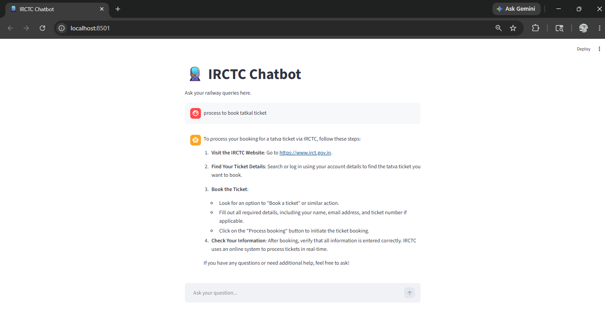

# 🚆 IRCTC Chatbot

A simple AI-powered chatbot built using Python, Streamlit, Ollama, and DeepSeek-R1 local model.
This chatbot helps users with basic IRCTC queries like ticket booking, Tatkal booking, cancellations, and railway-related support.


## 🔹 Technologies Used

* Python
* Streamlit
* Ollama
* DeepSeek-R1:1.5B

## 🔹 Features

* Railway query assistance
* Interactive chatbot interface
* Local AI model integration
* Beginner-friendly project

## 🔹 Run the Project

```bash
pip install streamlit ollama
```

```bash
ollama run deepseek-r1:1.5b
```

```bash
python -m streamlit run app.py
```

---

## 📸 OUTPUT



---
